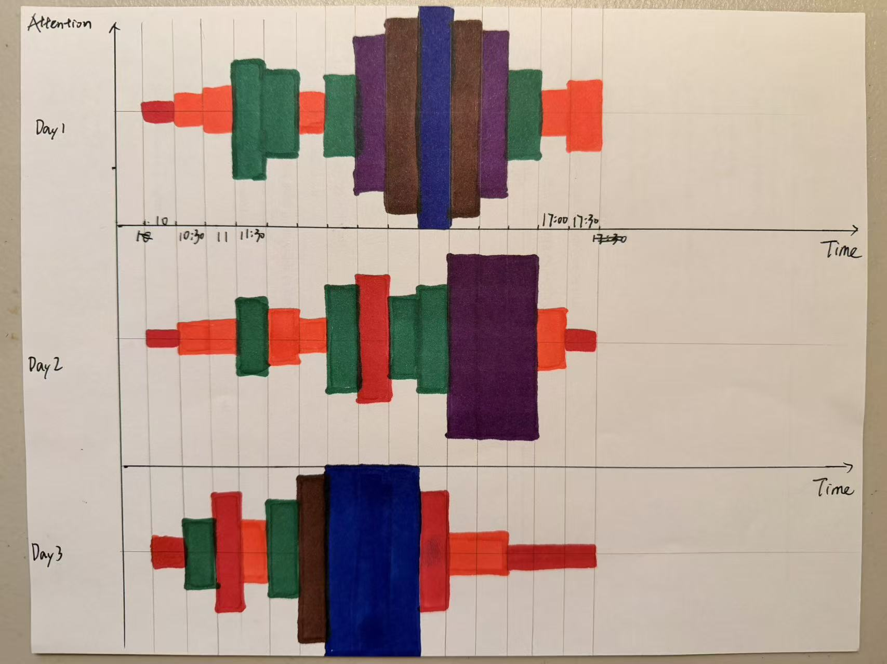
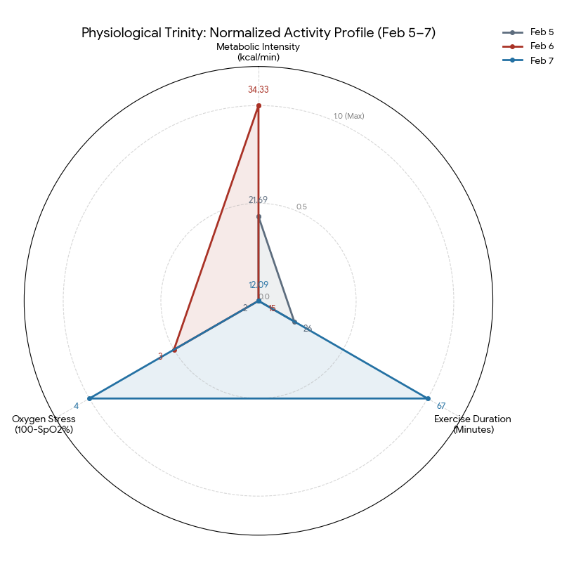
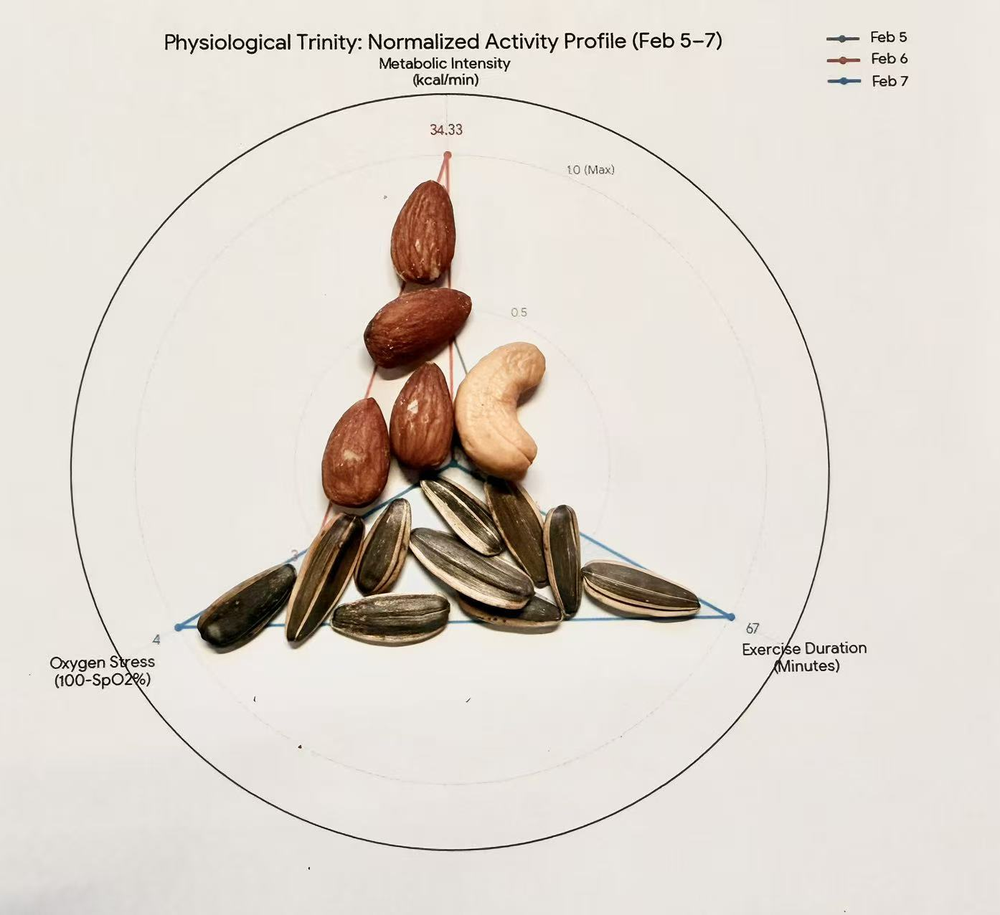

# Module 1: Data Physicalization Assignment
**Student Name:** Lianrui Geng

---

## Common Thread: Layers of Daily Experience

> **Central Theme:** *How does my daily life manifest across different layers of experience—from observable behavior, to hidden cognition, to embodied physiology?*

The three visualizations in this assignment are designed as a sequential investigation, each peeling back a deeper layer of lived experience. Rather than treating time, attention, and physiology as independent topics, I approach them as interconnected dimensions of the same underlying question: *What does a day really look like when examined from the outside in?*

The data was collected in sequence—first behavioral, then cognitive, then physiological—so that the findings of each stage could inform the framing of the next.

---

## Visualization 1: Daily Time Allocation as an Archipelago

### 1. Research Question
**How is my daily time distributed across different activities, and how does this structure change from day to day?**

This question focuses on understanding how my everyday life is divided between work, rest, and maintenance, and whether my daily structure remains stable or varies across days.

---

### 2. Data Collection- **Method:** Manual logging in a physical notebook at the end of each day (Day 1–Day 3).
- **Metric:** Time spent per activity, recorded in hours and rounded.
- **Process:** I intentionally avoided digital tracking tools. Logging by hand helped me reflect on my day rather than optimize or correct it. I also assigned colors to activities during logging to prepare for physical construction. I recorded the data each night at approximately 11:30 PM before sleeping, to ensure minimal recall delay and reduce retrospective distortion.

---

### 3. Visualization Images
**(A) Isometric Overview (3D City View)**  
Shows each day as an island and activities as colored towers forming a small town.

**(B) Side View (2D Bar-Chart-Like View)**  
From two different angles, tower heights align visually and can be read similarly to a bar chart.

**(C) Detail View**  
Show details about the town. We can't know the data structure if we are inside the town.

---

### 4. Process & Design Rationale- **Medium:** *Townscaper*. I chose this game because I had played it before and found that building a town with different colors was an intuitive and interesting way to represent different activities. The game is simple to use and easy to modify, which made it suitable for manual data construction.
- **3D Structure:** The visualization exists as a fully three-dimensional scene. By rotating the camera to a specific angle, the city can be read as a two-dimensional bar chart. Rotating to other angles turns it back into a 3D town. This shift between 3D and 2D is intentional and central to the design.
- **Mapping Rules:**
  - **Islands:** One island represents one day.
  - **Height:** One vertical block represents approximately one hour.
  - **Color Mapping:**

| Activity | Color |
|--------|-------|
| Sleep | Dark Blue |
| Research | Red |
| Homework | Orange |
| Reading | Yellow |
| Social / Chat | White |
| Eating / Cooking | Teal |
| Shopping | Grey |
| Gaming | Green |

- **Rationale:** Time is treated as physical volume. Sleep forms the base of each day, while work and maintenance activities compete vertically for space. The data is embedded in the structure rather than labeled explicitly.

- **Interaction Design (Extra Credit):**
  Townscaper provides a fully interactive 3D environment where the viewer can freely rotate, zoom, and pan the camera in real time. This interaction is not merely navigational—it fundamentally changes the *type* of visualization being perceived.

  - **3D → 2D Transition:** When the camera is positioned at a specific side angle, the three islands align into a row and their colored towers read as a conventional grouped bar chart. From this view, comparing daily time allocations across categories becomes straightforward.
  - **2D → 3D Transition:** Rotating the camera to an oblique or top-down angle restores the "city" metaphor. The data is no longer read analytically but experienced spatially—each day feels like a distinct place with its own skyline, and the viewer perceives relative proportions through volume and density rather than aligned heights.
  - **Detail Exploration:** Zooming into a single island reveals the stacking order and adjacency of color blocks, making it possible to see which activities are "neighbors" in the daily structure. This level of detail is invisible from the overview angle.

  **Function:** The interaction allows the same underlying dataset to serve dual purposes: analytical comparison (bar chart mode) and holistic impression (city mode). The viewer chooses the interpretation mode through physical gesture (camera rotation), making the act of reading the data an embodied, exploratory process.

  **Influence on Perception:** Without interaction, I would have had to choose one static view—either the analytical bar chart or the experiential cityscape. Being able to switch freely made me realize that my perception of "balance" depended on the viewing angle. The bar chart view emphasized numerical similarity across days, while the city view highlighted qualitative differences in composition and texture. Interaction revealed that a single dataset can support multiple, sometimes contradictory, narratives depending on how it is approached.

---

### 5. Synthesis of Findings- The visualization shows that my daily life is generally **work-life balanced**, which aligns with how I perceive my routine.
- Because one of the days falls on a weekend, research time drops sharply on that island, making the contrast between days very clear.
- Viewing the city from different angles made it easier to notice that each day has a distinct structure, even when the total time feels similar.
- Overall, the result matched my expectations, though it also made me realize that research time could be increased relative to other activities.

---

## Visualization 2: The Cognitive Waveform

### 1. Research Question
**How does the intensity of my cognitive focus fluctuate throughout the workday, and does the "shape" of my attention span differ between a standard day, a fragmented day, and a deadline day?**

While the first visualization looked at *what* I did, this question investigates *how well* I did it. I wanted to treat my attention span not as a simple resource, but as a fluctuating signal—to see if "flow state" has a visible pattern.

---

### 2. Data Collection- **Method:** Subjective self-assessment recorded in a pocket notebook.
- **Metric:** "Focus Score" on a scale of 1–10 (1 = Distracted/Tired, 10 = Deep Flow).
- **Frequency:** Every 30 minutes from 10:00 AM to 5:30 PM over three days.
- **Process:** To avoid the "Observer Effect" (where using a digital tool distracts me), I set a silent vibration alarm on my watch. When it buzzed, I scribbled a number. I also added brief qualitative notes (e.g., "coffee kick-in", "interrupted by chat") to explain shifts in the score.

---

### 3. Visualization Images
**(A) The Waveform Overview**  
A hand-drawn "spectrogram" representing three days of attention.

---

### 4. Process & Design Rationale- **Medium:** Analog Drawing (Markers & Pen on Paper). After using a digital 3D tool for the first visualization, I chose 2D hand-drawing to emphasize the "organic" and "imperfect" nature of human attention. The slight bleed of the markers on paper captures the fuzziness of focus better than crisp digital pixels.
- **Technique:** Mirrored Bar Chart / Audio Waveform. I visualized attention as an audio signal. A low focus score creates a thin, weak line (static noise), while a high focus score creates a thick, high-amplitude block (strong signal).
- **Mapping Rules:**
  - **X-Axis:** Time (Linear, 10:00 AM – 5:30 PM).
  - **Y-Axis (Amplitude):** The height of the bar corresponds to the Focus Score (mirrored up and down for symmetry).
  - **Color (Heatmap):**

| Focus Level | Color | Meaning |
|-------------|-------|---------|
| 1–4 | Red / Orange | Low Focus – "Noise" |
| 5–6 | Green | Normal Work – "Base Signal" |
| 7–8 | Purple / Brown | Deep Work – "High Frequency" |
| 9–10 | Blue | Flow State – "Peak Resonance" |

- **Rationale:** By mirroring the bars, the chart creates "shapes" or "blobs" of time. This allows me to see the *momentum* of my focus—how long it takes to ramp up to a blue state and how quickly it crashes to red.

---

### 5. Synthesis of FindingsThe "shape" of the waveforms revealed three distinct archetypes of workdays that I wasn't previously aware of:

- **Day 1 (The "Symmetrical" Day):** The waveform shows a smooth curve. I had a slow start (red/orange), a massive, sustained block of "Flow State" (Blue/Brown) in the middle, and a gentle taper off. This visualizes an ideal day where momentum is preserved.

- **Day 2 (The "Fragmented" Day):** The waveform looks like static noise. It is jagged with frequent dips into red/orange in the middle of the day. This corresponds to a day interrupted by meetings and chats. The visual "gaps" show how hard it is to build a "Purple/Blue" tower when the signal is constantly cut.

- **Day 3 (The "Deadline" Day):** The shape is blocky and unnatural. There is a sudden jump from low focus to extreme high focus (Blue), creating a solid "brick" of intensity. This represents "forced focus" due to a deadline. While productive, the abrupt red drop-off at the end shows the immediate burnout that followed.

---

## Visualization 3: The Physiological Trinity

### 1. Research Question
**How does the physiological load of my body differ across different types of physical activity, and can multi-dimensional biological signals reveal patterns not visible through step counts alone?**

While the first visualization examined *how I allocate time* and the second explored *how I experience attention*, this third visualization investigates *how my body responds physiologically* to different forms of activity. Instead of focusing on volume alone (e.g., steps), I examine metabolic intensity, oxygen stress, and exercise duration simultaneously.

---

### 2. Data Collection- **Source:** Apple Health (Feb 5–7)
- **Metrics Extracted:**
  - Active Calories (kcal)
  - Exercise Minutes (min)
  - Minimum Blood Oxygen (SpO₂)
  - Step Count (reference only)
- **Context:**
  - Feb 5: Gym workout
  - Feb 6: Light gym session
  - Feb 7: Basketball game (highest step count)
- **Extraction Process:** After each day of activity, I accessed Apple Health's summary view and manually transcribed the relevant metrics into my notebook. I recorded the values the same evening to minimize memory distortion. All derived calculations (intensity, oxygen stress) were computed manually, and the results were cross-checked against raw Apple Health entries to ensure accuracy.

- **Derived Metrics:**

| Dimension | Formula |
|-----------|---------|
| Metabolic Intensity | Active Calories ÷ Exercise Minutes (kcal/min) |
| Exercise Duration | Exercise Minutes |
| Oxygen Stress | 100 − Minimum SpO₂ |

To ensure comparability across dimensions, I applied **Min–Max normalization**:

x_norm = (x − min(X)) / (max(X) − min(X))

This allows the radar plot to represent relative physiological deviation rather than raw magnitude.

---

### 3. Visualization Image
**(A) Normalized Radar Plot – Physiological Trinity**

**(B) Nut-Based Physicalization – Embodied Energy Tokens**

To extend the physiological radar beyond a digital diagram, I created a physical representation using nuts placed directly on a printed radar template.

Unlike the digital rendering, this version treats each nut as a tangible "energy token." Because nuts are a common source of nutritional energy, they serve as a symbolic and material proxy for bodily load.

#### Mapping Rules (Physical Encoding)

- The same normalized values from the radar plot are used.
- 1 nut = 0.1 on the normalized scale.
- Nuts are placed along each axis from the center outward.
- Different nut types distinguish days:
  - Almonds → Feb 5
  - Cashews → Feb 6
  - Sunflower seeds → Feb 7
- The total number of nuts on each axis corresponds to the normalized magnitude of that physiological dimension.

This transforms abstract normalized values into countable, manipulable objects.

#### Why Nuts?

Nuts are calorically dense foods associated with sustained energy release.
Using them connects metabolic intensity and physiological load back to nutritional energy input.
The material itself therefore reinforces the conceptual theme of embodied strain.

#### Embodied Interpretation

Handling and placing the nuts made the distribution of load feel discrete rather than continuous.
Small differences between days became visible as differences in count, not just shape.
The physical mass accumulated along the duration axis on Feb 7 emphasized how sustained activity dominates overall strain.

---

### 4. Process & Design Rationale
- **Medium:** AI-assisted Digital Rendering (Google "Banana" generation tool). This visualization intentionally incorporates AI as a rendering assistant rather than an automated charting template. I manually extracted the raw physiological metrics, computed derived values, and applied Min–Max normalization before using the AI tool. The normalized values and axis structure were explicitly specified in the prompt. After generation, I verified that all numeric values matched my manually calculated data. The AI tool therefore functioned strictly as a visualization renderer, not as a data analysis or automatic charting system.
- **Structure:** A triangular physiological footprint composed of three axes:
  1. Metabolic Intensity (effort per minute)
  2. Exercise Duration (total sustained activity)
  3. Oxygen Stress (physiological depletion)

- **Mapping Rules:**
  - All axes are normalized to [0, 1].
  - Larger area represents greater physiological load (not necessarily better performance).
  - Each day forms a distinct geometric "signature."

- **Design Logic:**
  - The radar format emphasizes interdependence between variables.
  - A single metric (e.g., steps) cannot capture metabolic cost or oxygen demand.
  - The triangle shape visually encodes how intensity, duration, and oxygen consumption co-vary.

This visualization treats the body as a dynamic system rather than a simple counter of activity volume.

- **Physical Extension Layer:** This physical layer supplements the digital radar plot rather than replacing it. The radar provides structural clarity, while the nut tokens provide material embodiment. Together, they create a hybrid representation that moves from computational abstraction to tangible energy.

---

### 5. Synthesis of FindingsThe three days reveal distinct physiological archetypes:

- **Feb 5 – Moderate Duration, High Per-Minute Intensity:**
  The gym session shows elevated metabolic intensity but moderate duration and low oxygen stress. This suggests concentrated effort within a shorter timeframe.

- **Feb 6 – Highest Per-Minute Intensity, Short Duration:**
  Because exercise time was short, metabolic intensity appears amplified. The radar profile is vertically stretched but narrow elsewhere. This reveals how brief workouts can distort intensity metrics.

- **Feb 7 – Sustained Load and Oxygen Demand:**
  The basketball day forms the largest overall triangle. Although per-minute intensity is lower, long duration and higher oxygen stress indicate sustained cardiovascular strain.

**Key Insight:**
Gym training represents a peak-intensity model, while basketball reflects a sustained-load model. Oxygen stress scales more strongly with duration than with instantaneous intensity.

The nut-based physicalization revealed how physiological load can be experienced as accumulated "energy weight." Compared to the smooth radar shape, the physical tokens made rounding decisions and magnitude differences more perceptible.

---

## Final Synthesis
Across the three visualizations, a layered structure emerges:

| Layer | What it Measures | Insight |
|-------|------------------|---------|
| Time (Archipelago) | Allocation of hours | Structural balance |
| Cognition (Waveform) | Attention fluctuation | Momentum & fragmentation |
| Physiology (Trinity) | Biological load | Systemic response |

Together, they reveal a coherent pattern:

- My time structure is relatively stable.
- My attention fluctuates depending on context.
- My physiology responds most strongly to sustained effort rather than brief intensity.

The three visualizations move from **external structure → internal cognition → embodied response**, forming a multi-layered portrait of daily life.

Compared to the fully manual media used in the first two visualizations, incorporating AI in the third required a higher degree of verification and methodological transparency, reinforcing my awareness of authorship and data integrity.

### Common Thread: How the Questions Build on One Another

The three research questions were asked in sequence, and each was directly shaped by the findings of the previous one.

**Q1 → Q2:** The time allocation visualization (Archipelago) revealed that my daily structure is remarkably stable across days—similar hours devoted to similar categories. But this very stability raised a new question: *if the external structure looks the same, does the internal experience also remain the same?* This led me to investigate cognitive focus, shifting the lens from what I do to how well I do it.

**Q2 → Q3:** The cognitive waveform revealed that identical-looking time blocks can contain vastly different attention profiles—smooth flow, fragmented noise, or forced intensity. This made me wonder whether the body carries its own distinct "signature" for different activity types. If attention can vary independently of time structure, *does physiology also tell a different story from either time or cognition?* This motivated the physiological investigation, extending the inquiry from mind to body.

**Overall Progression:** The sequence moves from **external observation (behavior) → internal state (cognition) → embodied response (physiology)**, with each layer revealing variance that was invisible at the previous level. Time structure appears stable; attention reveals hidden turbulence within that stability; physiology exposes how the body accumulates strain in patterns that neither time nor attention alone can predict. Together, the three layers demonstrate that understanding daily life requires looking beyond any single dimension of measurement.

---

## Portfolio

This assignment has been published as a web-compatible portfolio entry and is publicly accessible at:

**[https://lianruibruce.github.io/comp617_extra/](https://lianruibruce.github.io/comp617_extra/)**
